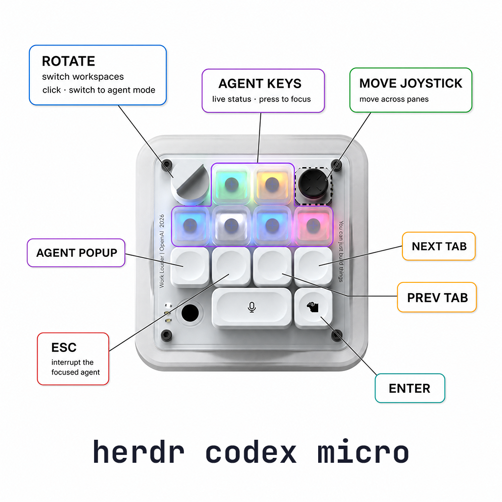

<p align="center">
  
</p>

<h3 align="center">House of Herdr</h3>

<p align="center">A collection of plugins for <a href="https://herdr.dev">Herdr</a>.</p>

## Plugins

### [codex-micro](packages/codex-micro)

Use your Work Louder Codex Micro (OpenAI edition) natively with Herdr: the six Agent Keys light up with live agent statuses, and the dial, joystick, and command keys control Herdr.

<p align="center">
  
</p>

```bash
herdr plugin install alasano/house-of-herdr/packages/codex-micro
```
